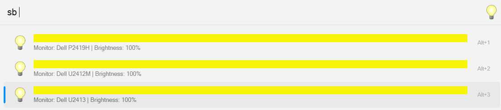
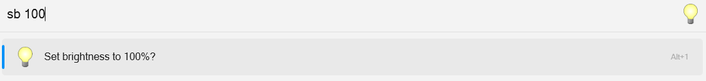

# Flow.Launcher.Plugin.ScreenBrightness
Lets you easily and quickly the brightness of all of your monitors

**Coming Soon**: Setting the brightness of individual monitors. I am hung up on the design, so it will come eventually.

## Useage

An empty query will get you the current brightness levels. From there, type in the new value, and click on the option.

